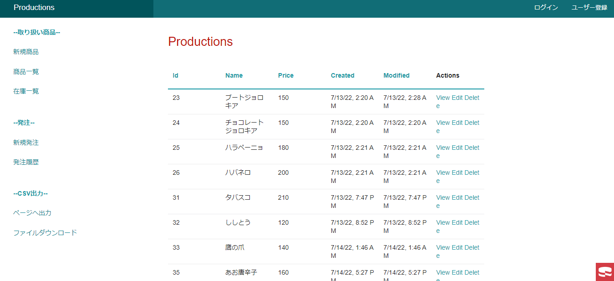
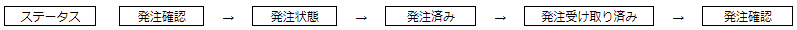
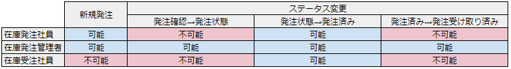

# TOPページ  
初期状態：商品一覧テーブルの一覧が表示されている  

サイドバー(取扱商品)：新規商品、商品一覧、在庫一覧  
サイドバー(発注)　　：新規発注、発注履歴  
サイドバー(CSV 出力)：ページへ出力、ファイルダウンロード  

ユーザー：在庫発注社員、在庫発注管理者、在庫受注社員  

# 発注機能  
新規発注およびステータス変更によって発注の進捗を管理することができる。
## 新規発注
新規発注ボタンにより発注を行うことができる  

## ステータス変更
編集を行うことによって下図の順番でステータスが推移  
在庫発注管理者はすべてのステータス変更を行える  
在庫発注社員と在庫受注社員は発注状態から発注済みに変更するときのみステータス変更を行える  
  

ステータスが後述の通りに遷移し、最後の発注受け取り済みになったときに発注数が在庫数に加算される  
新規発注ができるユーザーは在庫発注社員と在庫発注管理者のみ  

## ユーザー権限
各ユーザーに与えられた権限によって下図の通り行える操作が制限されている。

