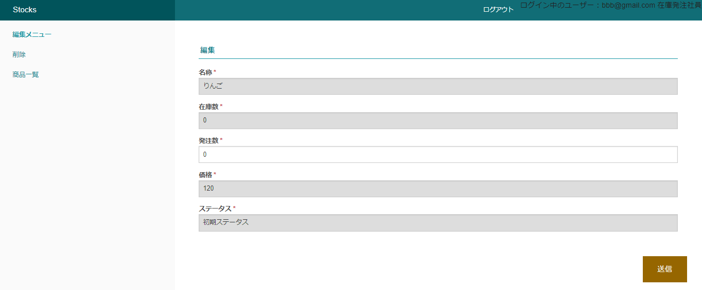

# TOPページ  
初期状態：商品一覧テーブルの一覧が表示されている  

サイドバー(取扱商品)：新規商品、商品一覧、在庫一覧  
サイドバー(発注)　　：新規発注、発注履歴  
サイドバー(CSV 出力)：ページへ出力、ファイルダウンロード  

ユーザー権限：在庫発注社員、在庫発注管理者、在庫受注社員  

# 発注機能  
新規発注ボタンにより発注を行うことができる  
ステータスが後述の通りに遷移し、最後の発注受け取り済みになったときに発注数が在庫数に加算される  

## ステータス遷移
編集を行うことによって下図の順番で推移  
ログイン中のユーザーを判別して遷移先を自動で変更（ユーザー自身は選択不可）  
  
作成時のステータスは初期ステータス  
2巡目以降は初期ステータスが存在せず、発注受け取り済みから始まる  
  
