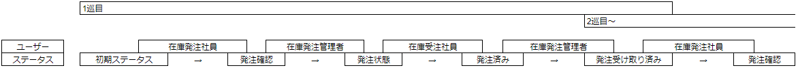

# TOPページ  
初期状態：stocksテーブルの一覧が表示されている  
ボタン表示：new stock、view、edit、delete  
権限：在庫発注社員、在庫発注管理者、在庫受注社員  
# edit機能  
order_quantityのみ編集可能  
ステータスが後述の通りに遷移  
ステータスが最後の発注受け取り済みになったときに  
order_quantityがstock_quantityに加算されてorder_quantityが0にリセットされます  
## ステータス遷移
editによって下図の順番で推移  
ログイン中のユーザーを判別して遷移先を自動で変更（ユーザー自身は選択不可）  
  
作成時のステータスは初期ステータス  
2巡目以降は初期ステータスが存在せず、発注受け取り済みから始まる  
  
